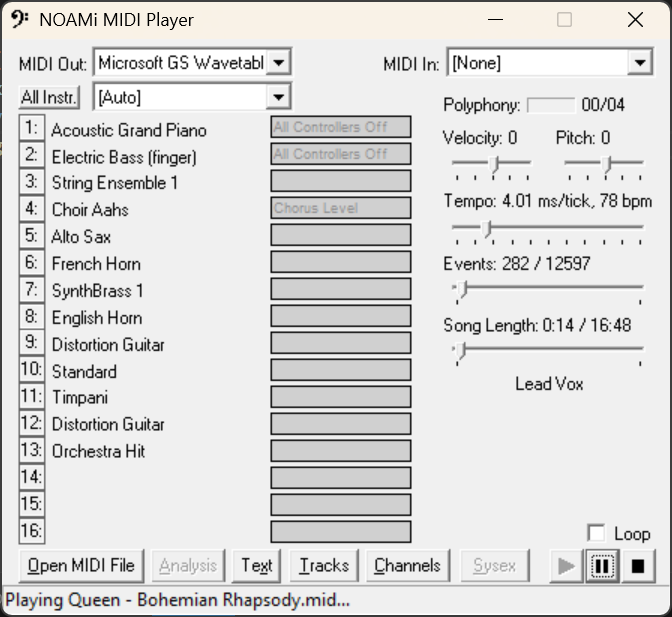

# NOAMi MIDI Player

NOAMi MIDI Player is a modernized fork of the [TMIDI project](https://grandgent.com/tom/projects/tmidi/). It keeps the lightweight Win32 MIDI playback engine, adds automated builds, and preserves a straightforward toolchain for anyone who wants a lightweight, MIDI player that talks directly to Windows multimedia APIs.



## Capabilities

- Standalone Win32 executable with no runtime dependencies beyond the Windows multimedia stack.
- Plays Standard MIDI Files using direct `winmm` calls, allowing low latency and deterministic channel routing.
- Provides visual playback controls, track/channel inspectors, and quick access to system-exclusive (SysEx) dumps embedded in a file.
- Ships with resource-only assets (icons, logos, speech tables) stored under `src/` so the binary can be rebuilt exactly as released.

## Releases

Check the following URL for the latest releases

https://github.com/numberformat/NOAMi-midi/releases/

> ⚠️ **Windows SmartScreen / “Untrusted Publisher” warning:** Releases are unsigned, so Windows may flag `NOAMi-MIDI.exe` when you first launch it. When you download NOAMi-MIDI.exe from GitHub, Windows tags the file with the “Mark of the Web” alternate data stream. Combined with the fact that the binary is unsigned, SmartScreen sees it as an unknown publisher and shows the warning. Use *More Info → Run Anyway* to proceed.

> ⚠️ As an alternative you can Unblock the file – Right‑click the downloaded .exe, open Properties, check “Unblock,” and hit OK. That removes the Mark of the Web stream so Windows stops treating it as internet content.

> ⚠️ Finally you can Build it yourself (via the documented local/Docker/CI flows). Locally built executables don’t carry the download marker, so you won’t see the prompt even though they’re still unsigned.
Until the binary is code-signed, those are the standard workarounds.

## Building from Source

### Prerequisites

- CMake 3.16 or newer.
- Either **MinGW-w64** (g++, windres, etc.) or the MSVC toolchain.
- Optional: Chocolatey to install CMake, MinGW, or Docker Desktop; Docker for cross compilation.

See the [changelog](CHANGELOG.md) for the latest tooling/refactoring updates, and the detailed [CI/CD notes](CICD-README.md) if you want to replicate the automated build and release pipeline elsewhere.

### Docker (MinGW cross build)

This is by far the easiest method to build the application from source. It does not require any other software on your machine other than Docker Desktop. 

To install Docker desktop using chocolatey just type: `choco install docker-desktop`

```powershell
# Make sure Docker Desktop is running and execute the following script from the base folder of the project.
docker-build.bat
```

Example Output when building using Docker Desktop

```
C:\Users\numbe\Downloads\tmidi>docker-build.bat
[docker] Building tmidi-builder image...
[+] Building 42.3s (7/7) FINISHED                                                                                    docker:desktop-linux
 => [internal] load build definition from Dockerfile                                                                                 0.0s
 => => transferring dockerfile: 252B                                                                                                 0.0s 
 => [internal] load metadata for docker.io/library/fedora:40                                                                         0.3s 
 => [internal] load .dockerignore                                                                                                    0.0s
 => => transferring context: 2B                                                                                                      0.0s 
 => CACHED [1/3] FROM docker.io/library/fedora:40@sha256:3c86d25fef9d2001712bc3d9b091fc40cf04be4767e48f1aa3b785bf58d300ed            0.0s 
 => => resolve docker.io/library/fedora:40@sha256:3c86d25fef9d2001712bc3d9b091fc40cf04be4767e48f1aa3b785bf58d300ed                   0.0s 
 => [2/3] RUN dnf install -y     mingw64-gcc mingw64-gcc-c++ mingw64-winpthreads-static     mingw64-headers mingw64-crt mingw64-bi  16.9s 
 => [3/3] WORKDIR /work                                                                                                              0.1s
 => exporting to image                                                                                                              13.9s
 => => exporting layers                                                                                                             10.6s
 => => exporting manifest sha256:9cb7a84abd4983810528097f310d025b3bd763a4a001a2ab1f8a45df2afd686a                                    0.0s
 => => exporting config sha256:6946e51407c88a6e1f1db24c28382521d979d7fe9d05c5ea9eda18e63aac15ba                                      0.0s 
 => => exporting attestation manifest sha256:1376fa93c9bb7f759f71f4a64672e59bca28033ce7d27569b79fc52274fd0ba7                        0.0s 
 => => exporting manifest list sha256:5e1a4676eb80745b748ca0b745314b0760f2c180867f42e48d7c8bb511965ce1                               0.0s 
 => => naming to docker.io/library/tmidi-builder:latest                                                                              0.0s 
 => => unpacking to docker.io/library/tmidi-builder:latest                                                                           3.2s 
[docker] Running build inside container...
-- The CXX compiler identification is GNU 14.1.1
-- Detecting CXX compiler ABI info
-- Detecting CXX compiler ABI info - done
-- Check for working CXX compiler: /usr/bin/x86_64-w64-mingw32-g++ - skipped
-- Detecting CXX compile features
-- Detecting CXX compile features - done
-- Configuring done (0.8s)
-- Generating done (0.0s)
CMake Warning:
  Manually-specified variables were not used by the project:

    CMAKE_C_COMPILER


-- Build files have been written to: /work/build/cmake
[1/3] Building RC object CMakeFiles/TMIDI.dir/src/tmidi.rc.res
[2/3] Building CXX object CMakeFiles/TMIDI.dir/src/tmidi.cpp.obj
[3/3] Linking CXX executable bin/NOAMi-MIDI.exe
[docker] Done. Binary is in build\cmake\bin\NOAMi-MIDI.exe

```

The helper script builds the included `Dockerfile` (Fedora + MinGW) and runs CMake/Ninja inside the container, writing `build\cmake\bin\NOAMi-MIDI.exe` back to the host.

### Continuous Integration

GitHub Actions (`.github/workflows/build.yml`) mirrors the Docker build. Pushes to `main`, `master`, or `cicd` run the containerized build and publish the resulting `NOAMi-MIDI.exe` as a workflow artifact. Tagging a release (`v*`) triggers the same build and automatically attaches the generated executable to the corresponding GitHub Release.

## NON-Docker builds

NOAMi-MIDI now builds exclusively via CMake. Pick the generator that matches your toolchain:

### Windows Toolchain Setup (via Chocolatey)

1. Install [Chocolatey](https://chocolatey.org/install) if it is not already present.
2. Install MinGW (provides `g++`, `windres`, and `mingw32-make`):
   ```powershell
   choco install mingw -y
   refreshenv
   ```
   After installation, ensure `C:\tools\mingw64\bin` (or the path printed by Chocolatey) is on `PATH`.
3. Install CMake with PATH integration so both Command Prompt and PowerShell can find it:
   ```powershell
   choco install cmake --installargs 'ADD_CMAKE_TO_PATH=System' -y
   refreshenv
   ```
4. (Optional) Install Visual Studio if you plan to generate a native `.sln` via CMake.

#### Convenience scripts

From PowerShell or Command Prompt:

- `build.bat [Debug|Release]` – configures and builds (defaults to Release). If `cmake` or `g++` are missing, the script prints Chocolatey install instructions.
- `run.bat [Debug|Release]` – builds if needed, then launches `build\cmake\bin\NOAMi-MIDI.exe`.
- `clean.bat` – removes the entire `build` directory.

### MinGW / GCC (Command Line)

```powershell
cmake -S . -B build/cmake -G "MinGW Makefiles" -DCMAKE_BUILD_TYPE=Release
cmake --build build/cmake --config Release
```

Artifacts are written to `build/cmake/bin/NOAMi-MIDI.exe`. Swap `Release` for `Debug` in both commands to obtain a debug build.

### Visual Studio (Generated via CMake)

This is untested please let me know if it worked for you.
```powershell
cmake -S . -B build/vs -G "Visual Studio 17 2022"
cmake --build build/vs --config Release
```

This produces a native `.sln` inside `build/vs/` using the current Visual Studio toolset while keeping the authoritative build logic in CMake.

## Repository Layout

- `src/` – All application sources, headers, the resource script, and binary assets (icons/bitmaps/sysex data).
- `build/` – Auto-generated by CMake (e.g., `build/cmake`, `build/vs`); ignored by git and safe to delete (or run `clean.bat`).

## License

NOAMi MIDI Player continues to ship under the MIT License. The `LICENSE` file includes both the original copyright line:

```
Copyright (c) 1999–2015 Tom Grandgent
Copyright (c) 2025 Neeraj Verma - http://noami.us
```

Any redistribution must retain those notices and the full MIT terms.
